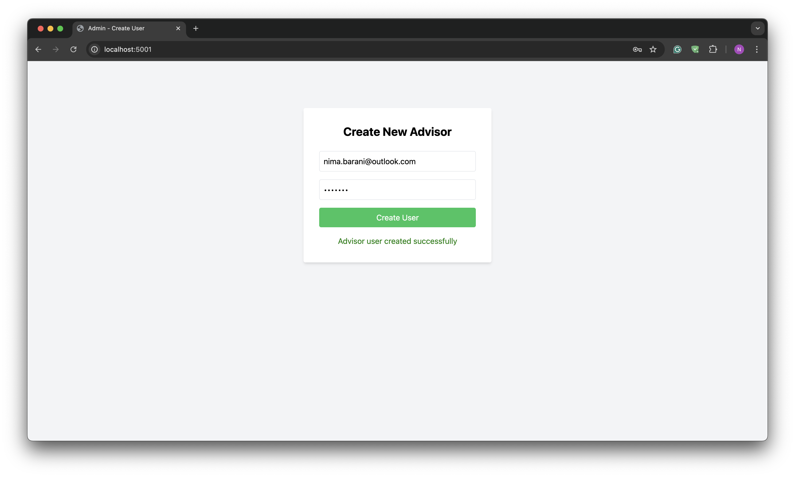
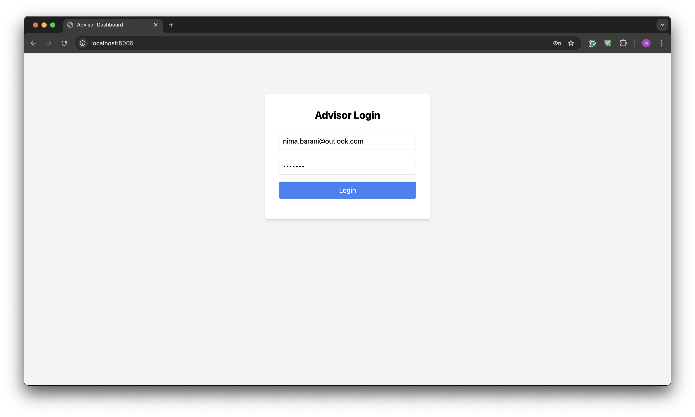
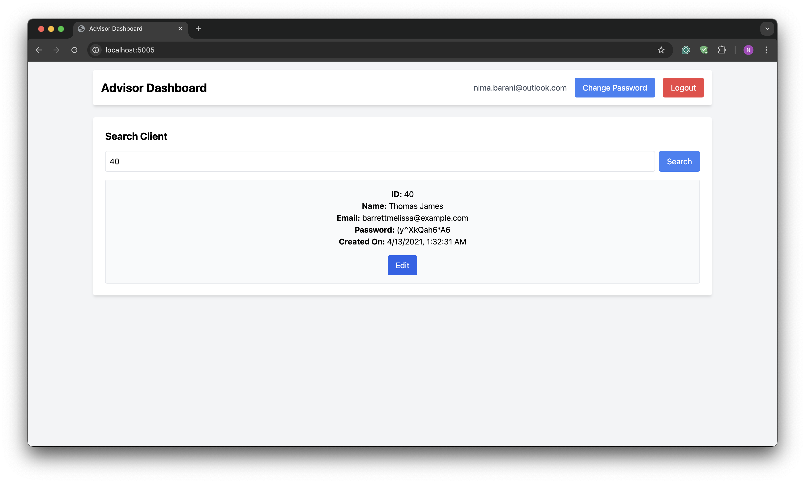
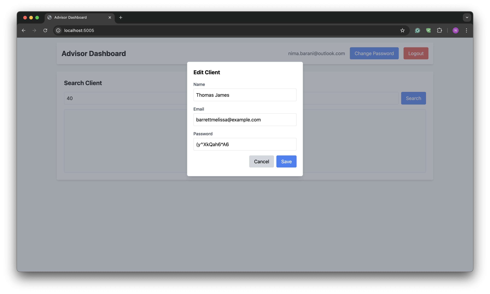

# Client Credentials Management System

This project implements a secure client credential storage API using Flask and PostgreSQL. The system supports data encryption using `pgcrypto`, automatic database setup via Docker Compose, and includes admin and user interfaces.

## Overview

This system provides a secure platform for advisors to retreive and modify clients information with the following key features:

- **Encrypted Data Storage**: Client data is encrypted at rest using PostgreSQL's pgcrypto extension
- **Session-based Authentication**: Secure advisor login system with password management
- **Dual Interface**: Separate main app and admin panel for different user roles
- **Docker Deployment**: Containerized application with PostgreSQL database

## Architecture

### Components

- **Main Flask App** (`app.py`): Primary application for advisor authentication and client management
- **Admin Flask App** (`admin_app.py`): Administrative interface for creating advisor accounts
- **PostgreSQL Database**: Stores encrypted client credentials and advisor authentication data
- **Docker Compose**: Orchestrates multi-container deployment

### Database Schema

- `public.client_credentials`: Encrypted client data (name, email, password)
- `public.user_credentials`: Advisor authentication data with salted password hashes
- `staging.client_credentials_raw`: Temporary table for CSV data import

## Prerequisites

- Docker
- PostgreSQL 17
- Python 3.12+

## Setup

### 1. Environment Configuration

Create environment files:

**`/db/.env`** (PostgreSQL configuration):
```bash
POSTGRES_DB=ClientDB
POSTGRES_USER=your_db_user
POSTGRES_PASSWORD=your_db_password
ENCRYPTION_KEY=your_32_character_encryption_key
```

**`/flask_app/.env`** (Flask application configuration):
```bash
ENCRYPTION_KEY=your_32_character_encryption_key
DB_HOST=postgres
DB_USER=your_db_user
DB_PASSWORD=your_db_password
DB_NAME=ClientDB
DB_PORT=5432
```

### 2. Database Initialization

The database is automatically initialized with:
- Database and table creation (`01_create_db_and_table.sql`)
- CSV data import and encryption (`02_import_and_encrypt.sql`)
- Sample client data from `client_data.csv`

### 3. Launch Application

```bash
docker compose up
```

## Usage

### Services

- **Main Application**: http://localhost:5005
- **Admin Panel**: http://localhost:5001
- **PostgreSQL**: localhost:5432

>Port 5000 is avoided on macOS because it's often occupied by the system's AirPlay server (ControlCenter), which automatically restarts if forcibly closed.

### Getting Started

1. **Create Advisor Account**: Use the admin panel to create advisor credentials



2. **Login**: Access the main application with advisor credentials



3. **Manage Clients**: Retrieve clients data by searching their cliend ID.



4. **Manage Clients**: View and update encrypted client information, and change advisor password




## API Endpoints

### Main Application (Port 5005)

| Method | Endpoint | Description | Authentication |
|--------|----------|-------------|----------------|
| GET | `/` | Serve main application page | No |
| POST | `/login` | Advisor authentication | No |
| POST | `/update-password` | Change advisor password | Session |
| GET | `/client/<id>` | Retrieve client details | Session |
| PUT | `/client/<id>` | Update client information | Session |
| POST | `/logout` | End advisor session | Session |

### Admin Panel (Port 5001)

| Method | Endpoint | Description |
|--------|----------|-------------|
| GET | `/` | Admin panel interface |
| POST | `/create-user` | Create new advisor account |

## Security Features

### Data Protection
- **Symmetric Encryption**: Client data encrypted using pgcrypto with environment-based keys
- **Password Security**: Salted SHA-256 hashing for advisor passwords
- **Session Management**: HTTP-only session cookies with secure configurations

### Input Validation
- Email format validation using regex patterns
- Password strength requirements (minimum 6 characters)
- SQL injection prevention through parameterized queries

### Access Control
- Session-based authentication for all protected endpoints
- Separate admin interface for user management
- Environment variable protection for sensitive configuration

## Development

### Project Structure
```
DBMS
├── db
│   ├── 01_create_db_and_table.sql
│   ├── 02_import_and_encrypt.sql
│   └── client_data.csv
├── docker-compose.yml
├── flask_app
│   ├── admin_app.py
│   ├── app.py
│   ├── Dockerfile
│   ├── requirements.txt
│   ├── templates
│   │   ├── admin.html
│   │   └── index.html
│   └── utils
│       ├── __init__.py
│       ├── common.py
│       ├── db.py
│       └── validators.py
├── notes.txt
└── README.md
```

### Dependencies
- Flask 2.3.3: Web framework
- psycopg2-binary 2.9.9: PostgreSQL adapter
- python-dotenv 1.0.1: Environment variable management

## Troubleshooting

### Common Issues

1. **Connection Errors**: Verify PostgreSQL container is running and environment variables are correct
2. **Encryption Failures**: Ensure ENCRYPTION_KEY is exactly 32 characters and matches in both environment files
3. **Permission Errors**: Check Docker volume permissions and PostgreSQL user privileges

### Logs
```bash
# View application logs
docker-compose logs flask-app
docker-compose logs admin-app
docker-compose logs postgres
```

## Security Considerations

- Store environment files securely and never commit them to version control
- Use strong, unique encryption keys in production
- Implement HTTPS in production environments
- Regular security audits and dependency updates
- Consider implementing rate limiting for authentication endpoints

## License

This project is for educational and demonstration purposes. Ensure compliance with applicable data protection regulations when handling client information.